# 📞 MIE - IVR Assistant with Twilio and Deepgram

This project has 2 approaches in it that deal the way data is recieved to and from Twilio. They are:
 1. Using Twilio native SST and TTS with the SST using a deepgram-nova-2 model.
 2. Streaming the input voice of the caller from twilio to deepgram and then streaming the deepgram TTS 
 response back to Twilio in the form of chunks


# 📞 APPROACH 1: MIE - IVR Assistant with native Twilio SST(with Deepgram model) and TTS

In shis approach  an **Interactive Voice Response (IVR) system** built using **Flask**, **Twilio Voice API**, and **Mistral AI**.  
It allows users to call a phone number, ask questions, and receive AI-generated responses in a **conversational voice interface**.

---

## ** Features**
✅ **Speech-to-Text (STT) with Twilio** – Converts spoken input into text(uses deepgram-nova-2 model).  
✅ **Text-to-Speech (TTS) with Twilio Polly** – Converts AI-generated responses into speech(Uses amazon-polly model).  
✅ **Conversational AI with Mistral** – Maintains history for back-and-forth dialogue.  
✅ **Flask Web Server** – Handles incoming Twilio calls and processes speech.  
✅ **Secure API Key Handling** – Prompts for `MISTRAL_API_KEY` only once.  
✅ **Scalable & Modular** – Designed for real-world IVR automation.  
✅ **Scalable & Modular** – Allows for barging in and halts the assistant voice when required.

---


## ** How It Works**
### **1️. Call Flow**
1. A user calls the IVR phone number (configured in Twilio).  
2. Twilio plays a **welcome message** and asks, **"What can I help you with today?"**  
3. **Twilio Speech-to-Text (STT)** transcribes the user's speech.  
4. The transcribed text is sent to **Mistral AI** via an API call.  
5. **Mistral AI** generates a response based on conversation history.  
6. Twilio's **Text-to-Speech (TTS)** reads out the AI's response.  
7. The user can continue the conversation or hang up.

### **2️. API Flow**
| **Endpoint** | **Purpose** |
|-------------|------------|
| **`/call`** | Starts the IVR and prompts for user input (speech). |
| **`/process_speech`** | Receives and processes transcribed speech, calls AI. |
| **`/speak_response`** | Reads the AI response and asks if the user has more questions. |

---

## ** Setup Instructions**
### **1️. Prerequisites**
- Python 3.7+ installed
- Twilio account ([Sign up for free](https://www.twilio.com/try-twilio))
- Mistral AI API Key ([Get it here](https://mistral.ai))
- ngrok (to expose Flask to the internet)

### **2️. Install Dependencies**
Run the following command:
```bash
pip install -r requirements.txt
```

### **3️. Set Up Twilio Phone Number**
- Log in to Twilio Console.
- Buy a phone number (or use a free trial number).(You should get free credits the first time)
- Go to Voice & Messaging Settings.
- Set "A Call Comes In" webhook to:
- http://your-ngrok-url/call (Replace your-ngrok-url with your actual ngrok public URL)
- Use POST method.
- Click Save.

### **4️. Start the Flask Server**
```bash
python app.py
```
It will ask for the Mistral API Key once, then store it in memory.


### **5️. Expose Server with ngrok**
- In a separate terminal, run:
```bash
ngrok http http://127.0.0.1:5000
```
- This gives you a public URL like:

https://random.ngrok-free.app

Copy this ngrok URL and update it in Twilio's webhook settings.


## ** Configuration**

Environment Variable	      Description
MISTRAL_API_KEY	API     ->    key for Mistral AI.

You can also store the API key in a .env file:

MISTRAL_API_KEY=your-key-here

## ** Youtube Demo

- Native Twilio TTS and STT - https://www.youtube.com/watch?v=rX2dQVOobQc 
- Native Twilio TTS(with deepgram nova 2 model) and STT - https://youtube.com/shorts/XHeusQa_7cE 

## Approach 1: IVR Call Flow - Sequence Diagram

```mermaid
sequenceDiagram
    participant Caller
    participant Twilio
    participant Flask Server
    participant Mistral AI

    Caller->>+Twilio: Calls IVR phone number
    Twilio->>+Flask Server: "A Call Comes In" → /call (Webhook)
    Flask Server->>+Twilio: Plays welcome message & starts speech recognition
    Twilio->>+Caller: "Welcome to the automated assistant. What can I help you with today?"

    Caller->>+Twilio: Asks a question (Speech)
    Twilio->>+Flask Server: Transcribes speech → /process_speech
    Flask Server->>+Mistral AI: Sends transcribed text & conversation history
    Mistral AI-->>Flask Server: Returns AI-generated response

    Flask Server->>+Twilio: Redirects response → /speak_response
    Twilio->>+Caller: Reads AI response (TTS)
    
    Caller->>+Twilio: Asks a follow-up question
    Twilio->>+Flask Server: Transcribes new question → /process_speech
    Flask Server->>+Mistral AI: Sends updated conversation history
    Mistral AI-->>Flask Server: Returns new AI-generated response

    Flask Server->>+Twilio: Redirects new response → /speak_response
    Twilio->>+Caller: "May I help you with something else?"
    
    Caller->>+Twilio: Hangs up (Optional)
    Twilio-->>Flask Server: Call Ends
```    




# 📡 APPROACH 2: MIE - IVR Assistant with Twilio Streaming + Deepgram STT/TTS + Mistral AI

In this approach, the IVR system uses **Twilio's bidirectional streaming** capabilities to directly pipe raw audio to **Deepgram for Speech-to-Text**, and then streams **Deepgram TTS responses** back to the caller — enabling a low-latency, barge-in–capable conversational flow powered by **Mistral AI**.

NOTE: I also have simple streaming of Twilio audio and speech-to-text conversion in another file(without LLM), in case
a simplified version of this code is needed in another usecase. The file you can look into for this is the twilio_to_deepgram_streaming.js file in streaming_approach directory.

---

## **Features**
✅ **Real-time Streaming STT with Deepgram** – Audio from Twilio is streamed live to Deepgram WebSocket endpoint for accurate transcription.  
✅ **Low-Latency TTS Streaming with Deepgram** – Mistral AI's responses are synthesized via Deepgram's TTS API and streamed back to Twilio in Mu-Law encoded chunks.  
✅ **Full Barge-In Support** – Users can interrupt the AI response mid-speech; the system halts playback and starts listening again. Also is thorough in recognizing when the AI stopped speaking. 
✅ **Conversational AI with Mistral** – Maintains memory for multi-turn voice conversations.  
✅ **WebSocket Server with Express + ws** – Handles real-time Twilio streams, Deepgram socket, and AI coordination.  
✅ **Format-Consistent Audio Pipeline** – Proper handling of Mu-Law to PCM conversions and vice versa.  
✅ **Timeout Detection** – Automatically triggers AI response when caller pauses.

---

## **How It Works**
### **1️. Call Flow**
1. Caller dials the Twilio number.
2. Twilio connects the call to your WebSocket server using `<Stream>` function.
3. Your WebSocket server:
   - Sends incoming audio to **Deepgram STT WebSocket**.
   - Buffers responses and watches for pause events (2s silence).
4. On pause, the latest transcript is sent to **Mistral AI**.
5. Mistral’s response is converted to **PCM** using **Deepgram TTS HTTP API**, then **Mu-Law encoded**, and streamed back to Twilio.
6. This loop continues until the user hangs up or the bot ends the session.

---

## **Server Structure**
| Component         | Role                                                                 |
|------------------|----------------------------------------------------------------------|
| `express` + `ws` | WebSocket server handling Twilio’s stream and Deepgram’s STT        |
| `wavefile`       | Decodes Mu-Law audio from Twilio into PCM for Deepgram              |
| `axios`          | Communicates with Deepgram TTS and Mistral AI                        |
| `Mu-Law encoder` | Converts PCM output to Mu-Law for Twilio playback                    |
| `env`            | `.env` file to securely store API keys                               |

---

## **Setup Instructions**
### **1️. Prerequisites**
- Node.js 18+
- A Twilio number (with programmable voice + streaming enabled)
- Deepgram API Key ([Get it here](https://developers.deepgram.com/))
- Mistral AI API Key ([Get it here](https://mistral.ai/))
- Ngrok (or similar tunneling service to expose localhost)
  
### **2️. Install Dependencies**
```bash
npm install
```

### **3. Configure Environment Variables**
Create a .env file in your root directory:
MISTRAL_API_KEY=your-mistral-key-here
DEEPGRAM_API_KEY=your-deepgram-key-here

### **4. Start the WebSocket Server**
Go to the required directory(streaming_approach) and start your server with:
```bash
node index.js
```

### **5. Expose your server with ngrok**
For exposing the server use:
```bash
ngrok http 8080
```
### **6. Update your Twilio webhook**
- Go to your Twilio Console → Phone Number Settings.
- Under "A Call Comes In", set the webhook to:

http://your-ngrok-url/

- Twilio will initiate a <Stream> connection to your WebSocket server on call connect.

## ** Youtube Demo

Link - https://www.youtube.com/shorts/KqPmdxK2dvk


## Approach 2: IVR Call Flow - Sequence Diagram 


# ** Example API Response**

Caller Asks:
"What are the hospital's working hours?"
IVR Responds:
"The hospital operates from Monday to Friday, 8:00 AM to 6:00 PM.
We remain closed on Saturdays and Sundays.
May I help you with anything else?"